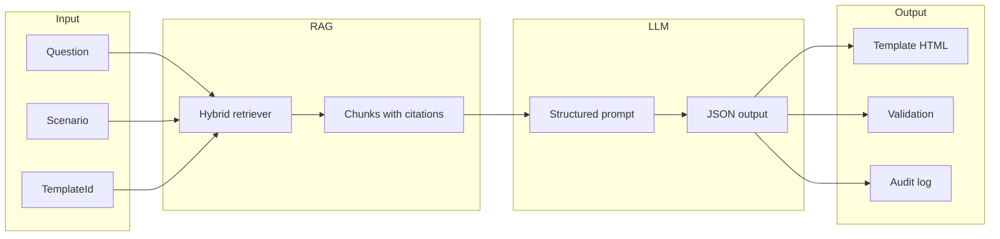

# PRA COREP Reporting Assistant (Prototype)

An LLM-assisted regulatory reporting assistant for UK PRA COREP returns. It turns a natural-language question and reporting scenario into a populated C 01.00 (Own Funds) template extract, grounded in retrieved PRA Rulebook and COREP instructions, with validation and a per-field audit log of rule paragraphs.

---

## The solution in brief

**Problem:** Preparing COREP returns is labour-intensive and error-prone: analysts must interpret dense, changing rules and map them into the correct template fields and codes.

**What we built:** A single end-to-end flow where the user asks a question and describes the scenario; the system retrieves relevant regulatory text, asks an LLM to fill a fixed schema (with mandatory citations), renders a human-readable template extract, runs basic validation, and exposes an audit log showing which rule paragraph justified each value.

**Success (prototype):** The current setup confirms the full flow — user question + scenario → **retrieval** → **structured LLM output** → **populated template extract** → **validation** → **audit log** → **export** — over a constrained COREP subset (C 01.00 Own Funds), without requiring real firm data.

---

## Technical architecture

- **Backend:** Python; orchestration in `service/pipeline.py`; no separate worker queue.
- **RAG:** Curated corpus (JSON) → paragraph-level chunks with metadata → hybrid retrieval (BM25 + dense embeddings) → Reciprocal Rank Fusion → top-k chunks with `chunk_id`, `source_ref`, `source_url` for citations.
- **LLM:** OpenAI (JSON mode); system prompt + user message (question, scenario, retrieved chunks); response parsed into a Pydantic schema with `source_chunk_ids` per field.
- **Output:** Rendered HTML template extract, validation result (errors/warnings), and audit log (field → list of paragraph_id, source_ref, excerpt).
- **Interfaces:** Streamlit UI (single screen) and FastAPI `POST /api/assist`; both call the same pipeline.

---

## Methodologies chosen

### 1. RAG (Retrieval-Augmented Generation)

- **Corpus:** Curated subset of PRA Rulebook and COREP instructions (e.g. reporting requirements, Own Funds template instructions) stored as JSON. Each item is one chunk with a unique `chunk_id`, `source_ref`, `source_url`, and optional `template_ref` (e.g. `CA1`).
- **Chunking:** For the prototype, the corpus is pre-chunked at paragraph/instruction-block level so that each chunk maps to a citable rule paragraph. Chunk metadata is mandatory for auditability.
- **Retrieval:** Hybrid retrieval to combine lexical and semantic signal:
  - **Sparse (BM25):** `rank_bm25` over tokenized chunk text; top-k sparse (default 10).
  - **Dense:** Sentence-transformers (`all-MiniLM-L6-v2`) over the same chunks; vectors stored in Chroma; top-k dense (default 10).
  - **Fusion:** Reciprocal Rank Fusion (RRF, k=60) over the two rank lists; take top 15 fused, then optionally filter by `template_ref` and return top 8 for the prompt.
- **Citation:** Every chunk returned has `chunk_id`, `source_ref`, `source_url`, `text`. The LLM is instructed to output `source_chunk_ids` per field; the audit log resolves these IDs to paragraph refs and short excerpts.

### 2. Structured LLM output

- **Schema:** Fixed Pydantic model for C 01.00 (Own Funds): `template_id`, `template_name`, `reference_date`, `answer_summary`, and a list of `fields` each with `field_id`, `value`, `source_chunk_ids`. Field IDs align to a subset of COREP rows (e.g. CA1_1_1 … CA1_1_4).
- **Prompt:** System prompt defines the task (reporting assistant), the output schema, and the rule: only use provided chunks and always cite `source_chunk_ids` for each populated field. User message = question + scenario + retrieved chunks (with IDs). Response format is JSON only (OpenAI `response_format: json_object`).
- **Parsing:** Response is parsed (including stripping markdown code blocks if present) and validated with Pydantic; missing or invalid fields are handled so the template and validation can still run.

### 3. Template extract and validation

- **Template extract:** The structured output is mapped to a human-readable HTML table (template name, reference date, row labels, amounts) so the user sees a COREP-style excerpt.
- **Validation rules:**  
  - **Required fields:** Certain field IDs (e.g. CA1_1_1–CA1_1_4) must be present; missing → error.  
  - **Numeric format:** Amount fields must be numeric; non-numeric → error.  
  - **Consistency:** Total (e.g. CA1_1_4) must equal the sum of components (CA1_1_1 + CA1_1_2 + CA1_1_3); violation → warning.
- **Output:** A validation result (valid flag, list of errors, list of warnings) shown in the UI and returned by the API.

### 4. Audit log

- **Build:** From the parsed schema (fields + `source_chunk_ids`) and the retrieved chunks keyed by `chunk_id`, we build an audit log: for each field, list of citations (paragraph_id, source_ref, source_url, short excerpt).
- **Exposure:** The audit log is included in the pipeline response (JSON) and displayed in the UI as expandable sections per field, so users can see which rule paragraph supported each value.

---

## Data flow



**Step-by-step:**

1. User supplies **question**, **scenario**, and **template** (e.g. C 01.00).
2. **Retriever** runs: query = "Question: … Scenario: …"; BM25 and dense search each return top-k; RRF merges and returns top chunks with `chunk_id`, `source_ref`, `source_url`, `text`.
3. **Prompt** is built: system (task + schema + citation rule) + user (question, scenario, retrieved chunks with IDs). **LLM** returns a single JSON object (template_id, answer_summary, fields with field_id, value, source_chunk_ids).
4. **Parse** JSON into `OwnFundsSchema`; **render** to HTML template extract; **validate** (required, numeric, total = sum); **build audit log** (field → citations from chunks).
5. UI/API returns **answer_summary**, **template_extract_html**, **validation** (valid, errors, warnings), **audit_log** (entries with field_id, value, citations).

---

## User interaction

### Streamlit UI

- **Single screen:** Text areas for "Question" and "Reporting scenario", dropdown for "Template" (C 01.00 / CA1), and a "Run assistant" button.
- **On submit:** The pipeline runs (retrieval → LLM → parse → render → validate → audit). A spinner is shown until the result is ready.
- **Result sections:**
  - **Answer summary:** Short narrative answer from the LLM.
  - **Template extract:** Rendered HTML table (C 01.00 Own Funds excerpt) with reference date and row/amount columns.
  - **Validation:** Pass/fail and list of errors (e.g. missing field, invalid format) and warnings (e.g. total ≠ sum of components).
  - **Audit log:** One expandable block per field; inside each, for every citation: paragraph_id, source_ref, excerpt, and link to source_url.
- A disclaimer reminds users that this is a prototype and that human review is required before submission.

### API

- **Endpoint:** `POST /api/assist`
- **Body:** `{"question": "...", "scenario": "...", "template_id": "C 01.00"}`
- **Response:** JSON with `answer_summary`, `template_extract_html`, `validation`, `audit_log`, `schema` (raw structured output). Same data as used by the UI.

---

## How to run locally

1. **Install**
   ```bash
   cd AKOIN
   pip install -r requirements.txt
   ```

2. **Environment**
   ```bash
   cp .env.example .env
   # Set OPENAI_API_KEY in .env (no quotes around the value)
   ```
   The app loads `.env` from the project root automatically via `config.py`. Run `streamlit run app.py` from the project directory so the key is found.

3. **Ingest corpus (build RAG indices)**
   ```bash
   python -c "from rag.ingest import ingest_corpus; ingest_corpus(); print('Done')"
   ```
   Re-run this whenever you change `data/corpus/curated_rules.json` so the new chunks are indexed.

4. **Run the UI**
   ```bash
   streamlit run app.py
   ```
   Open http://localhost:8501, enter question (and optional scenario), click "Run assistant".

5. **Optional: run API**
   ```bash
   uvicorn api.main:app --reload --host 0.0.0.0 --port 8000
   ```
   Then `POST /api/assist` with the JSON body above.

**Console warnings:** When the UI starts, you may see TensorFlow/PyTorch/CUDA messages (oneDNN, cuFFT, etc.). These are from the embedding stack and can be ignored. The app sets `TF_CPP_MIN_LOG_LEVEL=3` to reduce TensorFlow log noise.

---

## Prototype scope and adding real data later

The **current prototype confirms the end-to-end flow** without requiring real firm data. That flow is:

1. **Retrieval** — User question + scenario → hybrid RAG retrieves relevant regulatory chunks with citation metadata.  
2. **Structured output** — LLM produces JSON (template fields + values + `source_chunk_ids`) from those chunks only.  
3. **Populated template** — JSON is mapped to a human-readable C 01.00 extract (e.g. HTML table).  
4. **Validation** — Required fields, numeric format, and consistency (e.g. total = sum of components) are checked.  
5. **Audit log** — Each field is linked to the rule paragraphs that justify it (paragraph_id, source_ref, excerpt).  
6. **Export** — User can download the result (JSON) and template extract (TSV) to save or review.

The corpus currently includes both rule text and an **illustrative example** chunk with sample amounts so the template can be seen populated and the audit trail exercised. No real bank data is required to verify the flow.

**If you later add real data:** To use your own numbers (e.g. from a real COREP run), you can either:

- **Option A:** Add a chunk in `data/corpus/curated_rules.json` that describes or states those amounts (and optionally the reference date), then re-run ingestion so the new chunk is indexed. The assistant will then be able to retrieve and cite it when answering.
- **Option B:** Extend the app so the user can paste or upload amounts (e.g. CSV/Excel). The pipeline would fill the template from that input instead of (or in addition to) the LLM, while still using RAG for the answer summary and audit log where applicable.

---

## Deployment

- **Streamlit Cloud / Hugging Face Spaces:** Point to this repo, set `OPENAI_API_KEY` in secrets, run `streamlit run app.py`.
- **Docker:** `docker build -t corep-assistant . && docker run -p 8501:8501 -e OPENAI_API_KEY=sk-... corep-assistant`  
  The Dockerfile runs ingestion at build time so the image contains pre-built indices.

---

## Project layout

| Path | Role |
|------|------|
| `app.py` | Streamlit UI: inputs → run pipeline → show answer, template, validation, audit log |
| `api/main.py` | FastAPI app; `POST /api/assist` and `GET /health` |
| `service/pipeline.py` | Single pipeline: retriever → LLM → parse → render → validate → audit log |
| `rag/ingest.py` | Load corpus JSON, build BM25 + Chroma, persist chunks and indices |
| `rag/retriever.py` | Hybrid retriever (BM25 + Chroma, RRF), returns chunks with citation metadata |
| `llm/assistant.py` | Build prompt, call OpenAI (JSON mode), parse response to OwnFundsSchema |
| `schemas/corep_ca1.py` | Pydantic schema and CA1 constants (field IDs, labels, required, sum/total) |
| `template/render.py` | OwnFundsSchema → HTML template extract |
| `template/validation.py` | Required fields, numeric format, total = sum → ValidationResult |
| `audit/build.py` | Schema + chunks_by_id → AuditLog (field → citations) |
| `data/corpus/curated_rules.json` | Curated PRA/COREP rule paragraphs (chunk_id, source_ref, text, etc.) |
| `config.py` | Paths, model names, RAG top-k and index paths |

---

## Disclaimer

This is a **prototype**. Outputs are for assistance only. Always verify against the PRA Rulebook and obtain human review before any regulatory submission.
